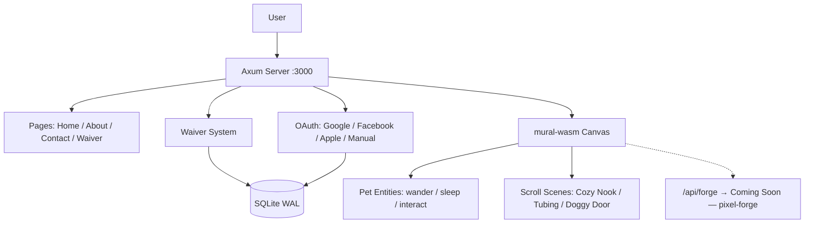

<!-- Unlicense — cochranblock.org -->

# Proof of Artifacts

*Concrete evidence that this project works, ships, and is real.*

> A veterinary professional services site with an interactive mural, multi-auth, and ESIGN-compliant waivers.

## Architecture



## Build Output

| Metric | Value |
|--------|-------|
| Release binary | 8.8 MB (down from 42 MB — strip, LTO, zero JS) |
| Lines of Rust | 2,679 (backend) + 755 (mural-wasm, archived) |
| JavaScript | 0 lines (removed all JS/WASM) |
| Direct dependencies | 28 (release) |
| Android AAB | 4.6 MB (Pocket Server) |
| Platforms | 12 targets (macOS, Linux, Android, iOS, Windows, FreeBSD, RISC-V, POWER, PWA) |
| Auth providers | 4 (Google, Facebook, Apple, manual email/password) |
| Waiver compliance | ESIGN-compliant, SHA256 terms versioning, typed signature, 7-year retention |
| Database | SQLite with WAL mode (production durability) |
| Federal compliance docs | 12 (SBOM, SSDF, FIPS, CMMC, supply chain audit, etc.) |
| Hot reload | Zero downtime deploy via SO_REUSEPORT + PID lockfile |

## Key Artifacts

| Artifact | Description |
|----------|-------------|
| Static Mural | Server-rendered mural image with CSS gradient overlay (zero JS) |
| Waiver System | Full audit trail: IP, User-Agent, terms hash, consent checkbox, signature. SQLite + gzip archive with auto-prune |
| Multi-Auth Stack | Google/Facebook/Apple OAuth + manual signup. HMAC-SHA256 signed session cookies |
| D1 Sharded Auth | Optional Cloudflare D1 backend — Coming Soon — waiting on [approuter](https://github.com/cochranblock/approuter) D1 integration |
| Pixel Forge Integration | /api/forge — Coming Soon — waiting on [pixel-forge](https://github.com/cochranblock/pixel-forge) + [kova](https://github.com/cochranblock/kova) IRONHIVE cluster |

## QA Results (2026-03-30)

| Pass | Checks | Result |
|------|--------|--------|
| Triple Sims 1/3 | 25 checks (21 pass, 4 skip — auth-gated) | OK |
| Triple Sims 2/3 | 25 checks | OK |
| Triple Sims 3/3 | 25 checks | OK |
| Clippy (release) | 0 warnings | Clean |
| Clippy (tests) | 0 warnings | Clean |
| Route coverage | 19 routes tested, 0 unexpected 404s | Pass |
| Binary size | 8.8 MB release (strip + LTO + zero JS) | Target met |
| Supply chain audit | 1 CVE fixed, 0 in release binary | Pass |
| Android AAB | 4.6 MB builds successfully | Pass |

## How to Verify

```bash
cargo build --release -p oakilydokily --features approuter
ls -lh target/release/oakilydokily  # should be ~9 MB
cargo run -p oakilydokily --bin oakilydokily-test --features tests
# Open localhost:3000 — scroll the mural, watch pets interact
# Visit /waiver — complete ESIGN flow with typed signature
# Visit /about — print-ready resume
```

---

*Part of the [CochranBlock](https://cochranblock.org) zero-cloud architecture. All source under the Unlicense.*
