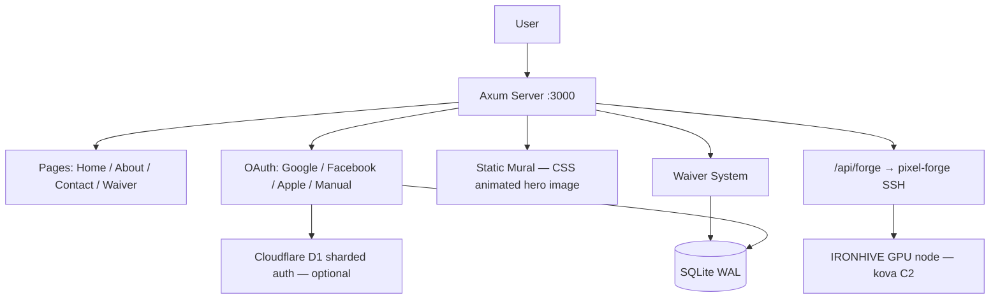

<!-- Unlicense — cochranblock.org -->

# Proof of Artifacts

*Concrete evidence that this project works, ships, and is real.*

> A veterinary professional services site with multi-auth, ESIGN-compliant waivers, federal compliance docs, and AI sprite generation. Part of [CochranBlock](https://cochranblock.org).

## Architecture



## Build Output

| Metric | Value |
|--------|-------|
| Release binary | 8.8 MB (down from 42 MB — strip, LTO, codegen-units=1, zero JS) |
| Lines of Rust | 3,211 (backend, 19 files) + 1,192 (mural-wasm + mural-claymation, archived) |
| JavaScript | 0 lines in release binary |
| Direct dependencies | 28 (release with approuter) |
| Routes registered | 32 (home/about/contact, waiver, auth ×9, forge, govdocs ×13, health, sitemap, assets) |
| Unit tests | 15 (12 in `waiver.rs`, 3 in `forge.rs`) |
| Integration checks | 59 (38 route/content + 8 adversarial POST + 5 forge auth/injection + 8 snapshot) |
| Android AAB | 4.6 MB (Pocket Server scaffold) |
| Platforms | 12 targets (macOS, Linux, Android, iOS, Windows, FreeBSD, RISC-V, POWER, PWA) |
| Auth providers | 4 (Google, Facebook, Apple, manual email/password) |
| Waiver compliance | ESIGN-compliant, SHA256 terms versioning, typed signature, 7-year retention |
| Database | SQLite with WAL mode (production durability) |
| Federal compliance docs | 13 (SBOM, SSDF, FIPS, CMMC, supply chain audit, etc.) |
| Hot reload | Zero downtime deploy via SO_REUSEPORT + PID lockfile |
| Rate limiting | 10 requests/IP/60s on auth endpoints, HashMap pruned every 60s |
| Startup guard | SESSION_SECRET fail-fast: <32 chars exits with clear error when any auth provider is configured |

## Key Artifacts

| Artifact | Description |
|----------|-------------|
| Static Mural | Server-rendered mural image with CSS gradient overlay (zero JS) |
| Waiver System | Full audit trail: IP, User-Agent, terms hash, consent checkbox, signature. SQLite + gzip archive with auto-prune |
| Multi-Auth Stack | Google/Facebook/Apple OAuth + manual signup. HMAC-SHA256 signed session cookies |
| D1 Sharded Auth | Optional Cloudflare D1 backend — active when `OD_AUTH_D1=1` + D1 env vars set |
| Pixel Forge (hardened) | /api/forge — authed SSH dispatch to [pixel-forge](https://github.com/cochranblock/pixel-forge) on [kova](https://github.com/cochranblock/kova) IRONHIVE GPU node. Compile-time-constant remote command + stdin-only JSON delivery. 3-attempt retry with 0/1/2s backoff |
| Rate Limiting | IP-based sliding window (10/60s) on login and signup endpoints; background tokio task prunes HashMap every 60s |
| Async I/O | All external HTTP calls (OAuth, email, Turnstile) use async reqwest |
| BACKLOG.md | Self-reorganizing prioritized work stack, max 20 items, cross-project dependency tags |

## Named Techniques

| Technique | Where | Summary |
|-----------|-------|---------|
| Single-Binary ESIGN Waiver | `src/waiver.rs`, `src/web/waiver.rs` | ESIGN Act compliance (15 U.S.C. 7001-7031) in a single Rust binary: typed signature field distinct from full_name (intent to sign), SQLite WAL, 7-year retention via 2,557-day archive prune, multi-auth identity verification. No DocuSign, no cloud, no monthly fee |
| Zero-JS Architecture | `src/web/` | 3,211 Rust / 0 JavaScript. Server-rendered HTML via Axum handlers, CSS-only animations, HTML forms as the client-server protocol. No Node.js, no npm, no webpack, no client-side supply chain |
| Forge Shell-Injection-Proof RPC | `src/web/forge.rs` | Compile-time-constant remote command (`remote_cmd()`) with user JSON delivered via child process stdin — never touches the shell. Auth gate rejects unauthed callers with 401 before any SSH is attempted. Unit test asserts no user field names appear in the remote command string |

## QA Results (2026-04-03)

| Pass | Checks | Result |
|------|--------|--------|
| Triple Sims 1/3 | 38 checks (0 skips — `OD_TEST_WAIVER_BYPASS=1`) | OK |
| Triple Sims 2/3 | 38 checks | OK |
| Triple Sims 3/3 | 38 checks | OK |
| Adversarial POST /waiver | 8 payloads (XSS, SQLi, oversized, missing consent) | All rejected 400/303 |
| Forge auth gate | Unauthenticated POST /api/forge | 401 (SSH never invoked) |
| Forge injection | 4 shell-metacharacter payloads (`' $ \` \n`) | All 401, remote_cmd constant |
| Snapshot content | 8 landmark checks (titles, form fields, skip link, sitemap) | Pass |
| Unit tests | 15 (12 waiver + 3 forge) | Green |
| Clippy (release) | 0 warnings (`-D warnings`) | Clean |
| Clippy (tests) | 0 warnings (`-D warnings`) | Clean |
| Binary size | 8.8 MB release (strip + LTO + codegen-units=1 + zero JS) | Target met |
| Supply chain audit | 1 CVE fixed, 0 in release binary | Pass |
| dead_code allows | 0 (removed from all 9 files) | Clean |
| SESSION_SECRET fail-fast | <32 chars with any auth provider configured → exits at startup | Active |

## P23 Triple Lens Analysis (2026-04-03)

Architecture risk/opportunity analysis of the [kova](https://github.com/cochranblock/kova) pyramid using the P23 Triple Lens Protocol — three opposing AI perspectives (optimist, pessimist, paranoia) synthesized into ground truth. Dispatched across fleet panes: [rogue-repo](https://github.com/cochranblock/rogue-repo) (optimist), [ronin-sites](https://github.com/cochranblock/ronin-sites) (pessimist), [illbethejudgeofthat](https://github.com/cochranblock/illbethejudgeofthat) (paranoia). Synthesis from this pane (oakilydokily).

| Finding | Lenses | Verdict |
|---------|--------|---------|
| Infrastructure is real (10K+ lines, 3 models, tournament) | All agree | Ship-ready foundation |
| mmap'd nanobyte needs integrity checks | Paranoia flags, optimist silent | Ed25519 signature + offset bounds before ship |
| Confidence calibration is the silent killer | Paranoia flags, optimist silent | Calibrate T1→T2 thresholds on held-out sets |
| Training corpus (crates.io) is unfiltered | Paranoia flags, optimist calls it a feature | Need min-downloads filter + adversarial negatives |
| Never delete Claude API key | Conflict: optimist says Phase 4, paranoia says irreversible | Graduate to "Claude-rare", never "Claude-impossible" |
| Localhost HTTP has no auth | Paranoia critical | Unix socket or local API key minimum |

## How to Verify

```bash
cargo build --release -p oakilydokily --features approuter
ls -lh target/release/oakilydokily  # should be ~8.8 MB
cargo run -p oakilydokily --bin oakilydokily-test --features tests
# 38 integration checks + 8 adversarial + 5 forge + 8 snapshot = 59 checks
# Open localhost:3000 — static mural hero, CSS animated
# Visit /waiver — complete ESIGN flow with typed signature
# Visit /about — print-ready resume
# Visit /govdocs — 13 federal compliance docs
# POST /api/forge without auth — must return 401 (RCE gate)
```

## Sibling Repos

| Repo | Role |
|------|------|
| [approuter](https://github.com/cochranblock/approuter) | Reverse proxy, production hosting |
| [pixel-forge](https://github.com/cochranblock/pixel-forge) | AI sprite generation (forge backend) |
| [kova](https://github.com/cochranblock/kova) | Augment engine, IRONHIVE GPU cluster |
| [exopack](https://github.com/cochranblock/exopack) | Test framework (triple sims, screenshots) |
| [cochranblock](https://github.com/cochranblock/cochranblock) | Main site |
| [pocket-server](https://github.com/cochranblock/pocket-server) | Android pocket server scaffold |

---

*Part of the [CochranBlock](https://cochranblock.org) zero-cloud architecture. All source under the [Unlicense](LICENSE).*
