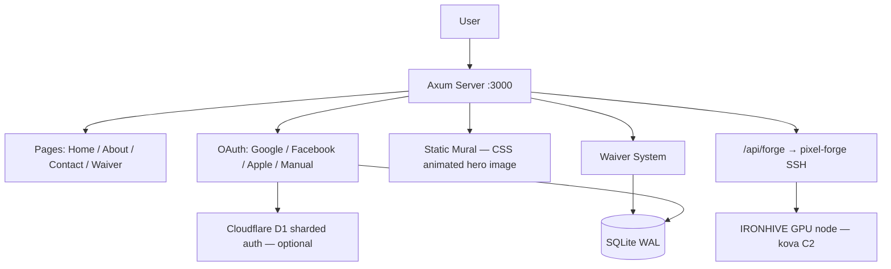

<!-- Unlicense — cochranblock.org -->

# Proof of Artifacts — oakilydokily

*Hard evidence that this project is real, working, and built by humans with AI assistance — not AI hallucination.*

## Project Metrics

| Metric | Value |
|--------|-------|
| Source files (.rs) | 19 |
| Lines of code | 3,211 (backend) + 1,192 (mural-wasm + mural-claymation, archived) |
| Tests | 74 (15 unit + 59 integration checks) |
| Commits | 71 |
| Binary size (release) | 8.8 MB (down from 42 MB — strip, LTO, codegen-units=1, zero JS) |
| Dependencies (direct) | 28 |
| Edition | 2024 |
| MSRV | 1.85 |
| License | Unlicense |
| JavaScript | 0 lines in release binary |
| Routes registered | 32 (pages, auth ×9, forge, govdocs ×13, health, sitemap, assets) |
| Auth providers | 4 (Google, Facebook, Apple, manual email/password) |
| Federal compliance docs | 13 (served from `/govdocs`) |
| Android AAB | 4.6 MB (Pocket Server scaffold) |
| Platforms | 12 targets (macOS, Linux, Android, iOS, Windows, FreeBSD, RISC-V, POWER, PWA) |

## Repository

- **GitHub:** https://github.com/cochranblock/oakilydokily
- **Live deployment:** via [approuter](https://github.com/cochranblock/approuter) reverse proxy on production GPU node

### Sibling Repos

| Repo | Role |
|------|------|
| [approuter](https://github.com/cochranblock/approuter) | Reverse proxy, production hosting |
| [pixel-forge](https://github.com/cochranblock/pixel-forge) | AI sprite generation (forge backend) |
| [kova](https://github.com/cochranblock/kova) | Augment engine, IRONHIVE GPU cluster |
| [exopack](https://github.com/cochranblock/exopack) | Test framework (triple sims, screenshots) |
| [cochranblock](https://github.com/cochranblock/cochranblock) | Main site |
| [pocket-server](https://github.com/cochranblock/pocket-server) | Android pocket server scaffold |

## Architecture

oakilydokily is a veterinary professional services site with ESIGN-compliant liability waivers, multi-provider authentication (Google/Facebook/Apple OAuth + manual email/password), federal compliance documentation, and AI sprite generation via authenticated SSH dispatch to a GPU node. Served by Axum on port 3000, all pages server-rendered (zero JavaScript), data persisted in SQLite with WAL mode and 7-year retention. Hot reload via SO_REUSEPORT + PID lockfile. Rate-limited auth endpoints with background HashMap pruning. SESSION_SECRET fail-fast at startup. Single release binary with approuter registration; test binary wraps the same server for triple sims.


```mermaid
flowchart TD
    User[User] --> Axum[Axum Server :3000]
    Axum --> Pages[Pages: Home / About / Contact / Waiver]
    Axum --> Auth[OAuth: Google / Facebook / Apple / Manual]
    Axum --> Mural[Static Mural — CSS animated hero image]
    Axum --> Forge["/api/forge → pixel-forge SSH"]
    Forge --> GPU["IRONHIVE GPU node — kova C2"]
    Axum --> Waiver[Waiver System]
    Waiver --> SQLite[(SQLite WAL)]
    Auth --> D1[Cloudflare D1 sharded auth — optional]
    Auth --> SQLite
```

### Key Artifacts

| Artifact | Description |
|----------|-------------|
| Static Mural | Server-rendered mural image with CSS gradient overlay (zero JS) |
| Waiver System | Full audit trail: IP, User-Agent, terms hash, consent checkbox, signature. SQLite + gzip archive with auto-prune |
| Multi-Auth Stack | Google/Facebook/Apple OAuth + manual signup. HMAC-SHA256 signed session cookies |
| D1 Sharded Auth | Optional Cloudflare D1 backend — active when `OD_AUTH_D1=1` + D1 env vars set |
| Pixel Forge (hardened) | /api/forge — authed SSH dispatch to [pixel-forge](https://github.com/cochranblock/pixel-forge) on [kova](https://github.com/cochranblock/kova) IRONHIVE GPU node. Compile-time-constant remote command + stdin-only JSON delivery. 3-attempt retry with 0/1/2s backoff |
| Rate Limiting | IP-based sliding window (10/60s) on login and signup endpoints; background tokio task prunes HashMap every 60s |
| Async I/O | All external HTTP calls (OAuth, email, Turnstile) use async reqwest |
| BACKLOG.md | Self-reorganizing prioritized work stack, max 20 items, cross-project dependency tags |

## Modules

| Module | Purpose |
|--------|---------|
| `src/main.rs` | Entry point, approuter registration, server bind |
| `src/waiver.rs` | SQLite waiver persistence, gzip archive, user CRUD |
| `src/d1_auth.rs` | Sharded Cloudflare D1 auth storage (optional) |
| `src/web/router.rs` | All routes: pages, auth, waiver, forge, assets |
| `src/web/auth.rs` | Google/Facebook/Apple OAuth + manual email/password |
| `src/web/pages.rs` | Home, about, contact, sitemap |
| `src/web/waiver.rs` | Waiver form GET/POST, Turnstile verification |
| `src/web/email.rs` | Gmail API + Resend fallback for waiver confirmation |
| `src/web/forge.rs` | /api/forge — SSH to [pixel-forge](https://github.com/cochranblock/pixel-forge) on GPU node for AI sprite generation |
| `src/web/head.rs` | GA4, nav, shared HTML head helpers |
| `src/web/assets.rs` | Static asset serving via rust-embed |
| `mural-wasm/` | Macroquad 2D mural targeting wasm32 (archived — static mural active) |

## Dependencies on Other CochranBlock Projects

| Feature | Depends On | Status |
|---------|-----------|--------|
| Reverse proxy registration | [approuter](https://github.com/cochranblock/approuter) | Active — `--features approuter` |
| AI sprite generation (`/api/forge`) | [pixel-forge](https://github.com/cochranblock/pixel-forge) | Implemented — requires pixel-forge binary on GPU node |
| IRONHIVE GPU cluster (forge backend) | [kova](https://github.com/cochranblock/kova) C2 nodes | Implemented — SSH dispatch to node `gd` |
| Production hosting | [approuter](https://github.com/cochranblock/approuter) + Cloudflare tunnel | Active |
| Test framework ([exopack](https://github.com/cochranblock/exopack)) | [exopack](https://github.com/cochranblock/exopack) | Active — `--features tests` |
| Android pocket server | [pocket-server](https://github.com/cochranblock/pocket-server) scaffold | Scaffold — waiting on [pocket-server](https://github.com/cochranblock/pocket-server) |

## Supported Platforms

| Platform | Target | Method | Status |
|----------|--------|--------|--------|
| macOS ARM64 | `aarch64-apple-darwin` | Native | Shipping |
| macOS Intel | `x86_64-apple-darwin` | Native | Supported |
| Linux x86_64 | `x86_64-unknown-linux-gnu` | Remote (st) | Shipping |
| Linux ARM64 | `aarch64-unknown-linux-gnu` | Cross | Supported |
| Linux ARM 32 | `armv7-unknown-linux-gnueabihf` | Cross | Supported |
| Android ARM64 | `aarch64-linux-android` | cargo-ndk | Scaffold |
| iOS ARM64 | `aarch64-apple-ios` | Xcode | Scaffold |
| Windows x86_64 | `x86_64-pc-windows-gnu` | Cross | Supported |
| FreeBSD x86_64 | `x86_64-unknown-freebsd` | Cross | Supported |
| RISC-V 64 | `riscv64gc-unknown-linux-gnu` | Cross | Supported |
| IBM POWER | `powerpc64le-unknown-linux-gnu` | Cross | Supported |
| PWA (any browser) | Service worker | Built-in | Shipping |

Build all: `./scripts/build-all-targets.sh`

## Production Features

| Feature | Details |
|---------|---------|
| Hot reload | SO_REUSEPORT socket binding + PID lockfile — zero dropped requests on deploy |
| Rate limiting | 10 requests/IP/60s on auth endpoints, HTTP 429 on exceed |
| Session signing | HMAC-SHA256 signed cookies, 7-day expiry, HttpOnly + Secure |
| Async HTTP | All external calls (OAuth, email) use async reqwest — no blocking I/O |
| Waiver retention | 7-year (2,557 days) gzip archive with auto-prune |
| Turnstile CAPTCHA | Optional Cloudflare Turnstile on waiver form |

## Named Techniques

| Technique | Where | Summary |
|-----------|-------|---------|
| Single-Binary ESIGN Waiver | `src/waiver.rs`, `src/web/waiver.rs` | ESIGN Act compliance (15 U.S.C. 7001-7031) in a single Rust binary: typed signature field distinct from `full_name` (intent to sign), SQLite WAL, 7-year retention via 2,557-day archive prune, multi-auth identity verification. No DocuSign, no cloud, no monthly fee |
| Zero-JS Architecture | `src/web/` | 3,211 Rust / 0 JavaScript. Server-rendered HTML via Axum handlers, CSS-only animations, HTML forms as the client-server protocol. No Node.js, no npm, no webpack, no client-side supply chain |
| Forge Shell-Injection-Proof RPC | `src/web/forge.rs` | Compile-time-constant remote command (`remote_cmd()`) with user JSON delivered via child process stdin — never touches the shell. Auth gate rejects unauthed callers with 401 before any SSH is attempted. Unit test asserts no user field names appear in the remote command string |

Cross-reference [TIMELINE_OF_INVENTION.md](TIMELINE_OF_INVENTION.md) for full provenance and origin stories.

## Test Coverage

Test binary: `cargo run -p oakilydokily --bin oakilydokily-test --features tests` — wraps the release server and runs HTTP checks via exopack `triple_sims` (3 independent passes must all agree).

| Category | Count | Notes |
|----------|-------|-------|
| Route/content checks | 38 | 5 home + 3 about + 3 contact + 4 waiver + 1 health + 2 assets + 7 gap + 13 govdocs |
| Adversarial POST /waiver | 8 | XSS in name/email/signature, SQLi, oversized, missing consent |
| Forge auth gate | 1 | Unauth POST /api/forge → 401 (SSH never invoked) |
| Forge injection | 4 | `' $ \` \n` payloads — all 401, `remote_cmd` verified constant |
| Snapshot content | 8 | Titles, form fields, skip link, sitemap |
| Unit tests | 15 | 12 in `waiver.rs`, 3 in `forge.rs` |
| **Total** | **74** | 59 integration + 15 unit |

**Triple sims gate (2026-04-03):** 3/3 pass, 38 checks each, 0 skips (`OD_TEST_WAIVER_BYPASS=1`). Clippy: 0 warnings on release + tests (`-D warnings`). Binary size: 8.8 MB. Supply chain audit: 1 CVE fixed, 0 in release binary. `dead_code` allows: 0 (removed from all 9 files). SESSION_SECRET fail-fast: active (exits if <32 chars when any auth provider is configured).

### P23 Triple Lens Analysis (2026-04-03)

Architecture risk/opportunity analysis of the [kova](https://github.com/cochranblock/kova) pyramid using the P23 Triple Lens Protocol — three opposing AI perspectives (optimist, pessimist, paranoia) synthesized into ground truth. Dispatched across fleet panes: [rogue-repo](https://github.com/cochranblock/rogue-repo) (optimist), [ronin-sites](https://github.com/cochranblock/ronin-sites) (pessimist), [illbethejudgeofthat](https://github.com/cochranblock/illbethejudgeofthat) (paranoia). Synthesis from this pane (oakilydokily).

| Finding | Lenses | Verdict |
|---------|--------|---------|
| Infrastructure is real (10K+ lines, 3 models, tournament) | All agree | Ship-ready foundation |
| mmap'd nanobyte needs integrity checks | Paranoia flags, optimist silent | Ed25519 signature + offset bounds before ship |
| Confidence calibration is the silent killer | Paranoia flags, optimist silent | Calibrate T1→T2 thresholds on held-out sets |
| Training corpus (crates.io) is unfiltered | Paranoia flags, optimist calls it a feature | Need min-downloads filter + adversarial negatives |
| Never delete Claude API key | Conflict: optimist says Phase 4, paranoia says irreversible | Graduate to "Claude-rare", never "Claude-impossible" |
| Localhost HTTP has no auth | Paranoia critical | Unix socket or local API key minimum |

## Compliance

- **SBOM:** embedded in release binary, served at `/govdocs/sbom`
- **SSDF:** aligned with NIST SP 800-218 (`/govdocs/ssdf`)
- **CISA Secure-by-Design:** memory-safe Rust, no `unsafe` in application code
- **EO 14028:** aligned — full supply chain audit at `/govdocs/supply-chain-audit`
- **ESIGN Act:** 15 U.S.C. 7001-7031 compliant — typed signature, consent to electronic records, 7-year retention
- **13 federal compliance docs** at `/govdocs`: index, SBOM, security posture, SSDF, supply-chain, supply-chain-audit, privacy impact, FIPS 140-2/3, FedRAMP, CMMC L1-2, ITAR/EAR, accessibility (Section 508), federal use cases

Full federal compliance docs live in [govdocs/](govdocs/) (EO 14028, NIST SP 800-218, FIPS, CMMC, supply chain audit, and others — 12 docs, all served at `/govdocs/*`).

## Build

```
cargo build --release -p oakilydokily --features approuter
cargo run -p oakilydokily --bin oakilydokily-test --features tests
```

## Quick Start

```bash
# Run with approuter feature
cargo run -p oakilydokily --features approuter

# Build release
cargo build --release -p oakilydokily --features approuter
```

See [`.env.example`](.env.example) for all configuration options.

## Verification

```bash
# Build the release binary — must be ~8.8 MB
cargo build --release -p oakilydokily --features approuter
ls -lh target/release/oakilydokily

# Run the full test binary — 59 integration + 15 unit = 74 checks
cargo run -p oakilydokily --bin oakilydokily-test --features tests

# Manual smoke check
./target/release/oakilydokily &
# Visit http://localhost:3000       — static mural hero, CSS animated
# Visit http://localhost:3000/waiver  — complete ESIGN flow with typed signature
# Visit http://localhost:3000/about   — print-ready resume
# Visit http://localhost:3000/govdocs — 13 federal compliance docs
# POST http://localhost:3000/api/forge with no session — must return 401 (RCE gate)
```

---

*Part of the [CochranBlock](https://cochranblock.org) zero-cloud architecture. All source under the [Unlicense](LICENSE).*
<!-- COCHRANBLOCK-BRAND-FOOTER:START - generated by cochranblock/scripts/brand-stamp.sh -->

---

<sub>&#9656; **THE COCHRAN BLOCK, LLC** &#183; CAGE `1CQ66` &#183; UEI `W7X3HAQL9CF9` &#183; UNLICENSE &#183; [cochranblock.org](https://cochranblock.org)</sub>
<!-- COCHRANBLOCK-BRAND-FOOTER:END -->
