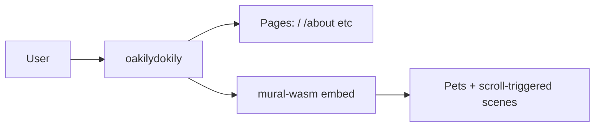

# oakilydokily

Hero site with interactive mural. Rust Axum server + mural-wasm (Macroquad).

## Proof of Artifacts

*Wire diagrams and demos for quick review.*

### Wire / Architecture



### Screenshots

| View | Description |
|------|-------------|
| Hero | Landing with mural embed |
| Mural | Interactive pets, Cozy Nook, Winter Tubing, Doggy Door |

### Demo

*Add `docs/artifacts/demo-scroll.gif` for scroll + mural interaction.*

---

## Run

```bash
cargo run -p oakilydokily --features approuter
```

## mural-wasm

See [mural-wasm/README.md](mural-wasm/README.md) for the interactive mural crate.
