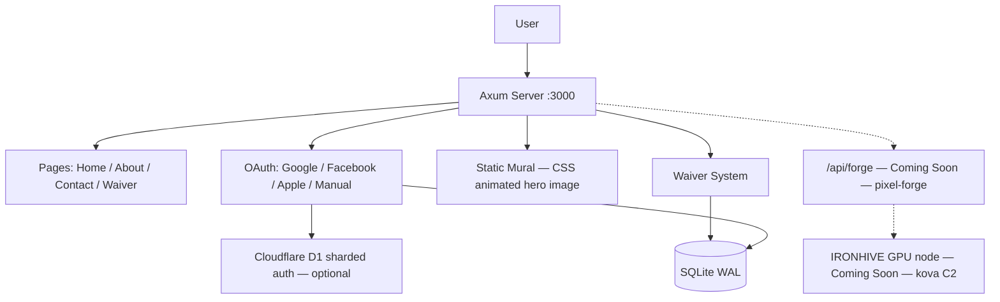

<!-- Unlicense — cochranblock.org -->
<!-- Contributors: Mattbusel (XFactor), GotEmCoach, KOVA, Claude Opus 4.6, SuperNinja, Composer 1.5, Google Gemini Pro 3 -->

> **It's not the Mech — it's the pilot.**
>
> This repo is part of [CochranBlock](https://cochranblock.org) — 14 Unlicense Rust repositories that power an entire company on a **single <10MB binary**, a laptop, and a **$10/month** Cloudflare tunnel. No AWS. No Kubernetes. No six-figure DevOps team. Zero cloud.
>
> **[cochranblock.org](https://cochranblock.org)** is a live demo of this architecture. You're welcome to read every line of source code — it's all public domain.
>
> Every repo ships with **[Proof of Artifacts](PROOF_OF_ARTIFACTS.md)** (wire diagrams, screenshots, and build output proving the work is real) and a **[Timeline of Invention](TIMELINE_OF_INVENTION.md)** (dated commit-level record of what was built, when, and why — proving human-piloted AI development, not generated spaghetti).
>
> **Looking to cut your server bill by 90%?** → [Zero-Cloud Tech Intake Form](https://cochranblock.org/deploy)

---

<p align="center">
  
</p>

# oakilydokily

Veterinary professional services site with multi-auth, ESIGN-compliant waivers, and federal compliance docs. Rust Axum server. Pixel forge sprite generation coming soon via [pixel-forge](https://github.com/cochranblock/pixel-forge) + IRONHIVE cluster.

## Architecture



## Modules

| Module | Purpose |
|--------|---------|
| `src/main.rs` | Entry point, approuter registration, server bind |
| `src/waiver.rs` | SQLite waiver persistence, gzip archive, user CRUD |
| `src/d1_auth.rs` | Sharded Cloudflare D1 auth storage (optional) |
| `src/web/router.rs` | All routes: pages, auth, waiver, forge, assets |
| `src/web/auth.rs` | Google/Facebook/Apple OAuth + manual email/password |
| `src/web/pages.rs` | Home, about, contact, sitemap |
| `src/web/waiver.rs` | Waiver form GET/POST, Turnstile verification |
| `src/web/email.rs` | Gmail API + Resend fallback for waiver confirmation |
| `src/web/forge.rs` | /api/forge — Coming Soon — waiting on [pixel-forge](https://github.com/cochranblock/pixel-forge) |
| `src/web/head.rs` | GA4, nav, shared HTML head helpers |
| `src/web/assets.rs` | Static asset serving via rust-embed |
| `mural-wasm/` | Macroquad 2D mural targeting wasm32 (archived — static mural active) |

## Dependencies on Other CochranBlock Projects

| Feature | Depends On | Status |
|---------|-----------|--------|
| Reverse proxy registration | [approuter](https://github.com/cochranblock/approuter) | Active — `--features approuter` |
| AI sprite generation (`/api/forge`) | [pixel-forge](https://github.com/cochranblock/pixel-forge) | Coming Soon — waiting on [pixel-forge](https://github.com/cochranblock/pixel-forge) |
| IRONHIVE GPU cluster (forge backend) | [kova](https://github.com/cochranblock/kova) C2 nodes | Coming Soon — waiting on [kova](https://github.com/cochranblock/kova) |
| Production hosting | [approuter](https://github.com/cochranblock/approuter) + Cloudflare tunnel | Active |
| Android pocket server | [pocket-server](https://github.com/cochranblock/pocket-server) scaffold | Coming Soon — waiting on [pocket-server](https://github.com/cochranblock/pocket-server) |

## Run

```bash
cargo run -p oakilydokily --features approuter
```

Build release:

```bash
cargo build --release -p oakilydokily --features approuter
```

## Supported Platforms

| Platform | Target | Method | Status |
|----------|--------|--------|--------|
| macOS ARM64 | `aarch64-apple-darwin` | Native | Shipping |
| macOS Intel | `x86_64-apple-darwin` | Native | Supported |
| Linux x86_64 | `x86_64-unknown-linux-gnu` | Remote (st) | Shipping |
| Linux ARM64 | `aarch64-unknown-linux-gnu` | Cross | Supported |
| Linux ARM 32 | `armv7-unknown-linux-gnueabihf` | Cross | Supported |
| Android ARM64 | `aarch64-linux-android` | cargo-ndk | Scaffold |
| iOS ARM64 | `aarch64-apple-ios` | Xcode | Scaffold |
| Windows x86_64 | `x86_64-pc-windows-gnu` | Cross | Supported |
| FreeBSD x86_64 | `x86_64-unknown-freebsd` | Cross | Supported |
| RISC-V 64 | `riscv64gc-unknown-linux-gnu` | Cross | Supported |
| IBM POWER | `powerpc64le-unknown-linux-gnu` | Cross | Supported |
| PWA (any browser) | Service worker | Built-in | Shipping |

Build all: `./scripts/build-all-targets.sh`

## Federal Compliance

See [govdocs/](govdocs/) for EO 14028, NIST SP 800-218, FIPS, CMMC, and other federal compliance documentation.