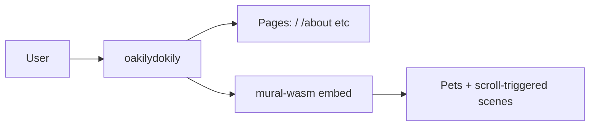

<!-- Unlicense — cochranblock.org -->
<!-- Contributors: Mattbusel (XFactor), GotEmCoach, KOVA, Claude Opus 4.6, SuperNinja, Composer 1.5, Google Gemini Pro 3 -->

> **It's not the Mech — it's the pilot.**
>
> This repo is part of [CochranBlock](https://cochranblock.org) — 8 Unlicense Rust repositories that power an entire company on a **single <10MB binary**, a laptop, and a **$10/month** Cloudflare tunnel. No AWS. No Kubernetes. No six-figure DevOps team. Zero cloud.
>
> **[cochranblock.org](https://cochranblock.org)** is a live demo of this architecture. You're welcome to read every line of source code — it's all public domain.
>
> Every repo ships with **[Proof of Artifacts](PROOF_OF_ARTIFACTS.md)** (wire diagrams, screenshots, and build output proving the work is real) and a **[Timeline of Invention](TIMELINE_OF_INVENTION.md)** (dated commit-level record of what was built, when, and why — proving human-piloted AI development, not generated spaghetti).
>
> **Looking to cut your server bill by 90%?** → [Zero-Cloud Tech Intake Form](https://cochranblock.org/deploy)

---

<p align="center">
  
</p>

# oakilydokily

Hero site with interactive mural. Rust Axum server + mural-wasm (Macroquad).

## Proof of Artifacts

*Wire diagrams and demos for quick review.*

### Wire / Architecture



### Screenshots

| View | Description |
|------|-------------|
| Hero | Landing with mural embed |
| Mural | Interactive pets, Cozy Nook, Winter Tubing, Doggy Door |

### Demo

*Add `docs/artifacts/demo-scroll.gif` for scroll + mural interaction.*

---

## Run

```bash
cargo run -p oakilydokily --features approuter
```

## mural-wasm

See [mural-wasm/README.md](mural-wasm/README.md) for the interactive mural crate.