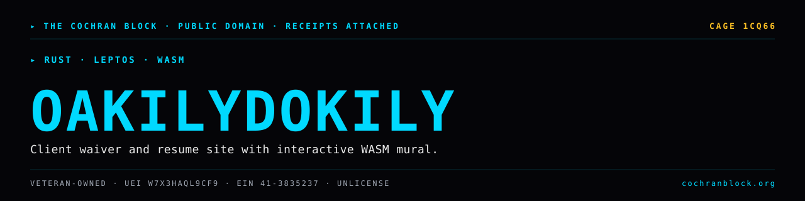

<!-- COCHRANBLOCK-BRAND-HEADER:START - generated by cochranblock/scripts/brand-stamp.sh -->
<picture>
  <source media="(prefers-color-scheme: dark)" srcset="assets/brand/banner.svg">
  <source media="(prefers-color-scheme: light)" srcset="assets/brand/banner.svg">
  
</picture>

[](https://unlicense.org)
[](https://www.rust-lang.org)
[](https://cochranblock.org)
[](https://cochranblock.org)

> &#9656; **RUST** &#183; **LEPTOS** &#183; **WASM**
<!-- COCHRANBLOCK-BRAND-HEADER:END -->

<p align="center">
  
</p>

# oakilydokily

**Veterinary professional services site. Multi-auth. ESIGN-compliant. Zero JavaScript. Pure Rust.**

Axum server with Google/Facebook/Apple OAuth, ESIGN-compliant liability waivers, federal compliance docs, and AI sprite generation at `/api/forge` via SSH to [pixel-forge](https://github.com/cochranblock/pixel-forge) on [kova](https://github.com/cochranblock/kova) GPU nodes.

---

## Documentation

This README is the entry point. The actual docs live in two source-of-truth files at the root of the repo:

- **[PROOF_OF_ARTIFACTS.md](PROOF_OF_ARTIFACTS.md)** — what exists today, status, source-linked. Build output, modules, routes, platforms, production features, named techniques, test coverage, federal compliance, P23 triple lens. If you want to know what this project *does*, read this.
- **[TIMELINE_OF_INVENTION.md](TIMELINE_OF_INVENTION.md)** — dated, commit-level record of what was built, when, and why. If you want to know how this project *got built*, read this.

Supporting docs:
- [BACKLOG.md](BACKLOG.md) — prioritized open work
- [CONTRIBUTORS.md](CONTRIBUTORS.md) — contributor list
- [ASSUMED_BREACH_THREAT_MODEL.md](ASSUMED_BREACH_THREAT_MODEL.md) — security threat model
- [USER_STORY_ANALYSIS.md](USER_STORY_ANALYSIS.md) — user story walk-through
- [govdocs/](govdocs/) — 13 federal compliance documents

---

## Run It

```bash
cargo run -p oakilydokily --features approuter
cargo build --release -p oakilydokily --features approuter
cargo run -p oakilydokily --bin oakilydokily-test --features tests
```

See [`.env.example`](.env.example) for all configuration options. Full build, test, and verification commands in [PROOF_OF_ARTIFACTS.md](PROOF_OF_ARTIFACTS.md).

---

## License

Unlicense (public domain). See [LICENSE](LICENSE).

Built by [The Cochran Block](https://cochranblock.org). Powered by [KOVA](https://github.com/cochranblock/kova).
<!-- COCHRANBLOCK-BRAND-FOOTER:START - generated by cochranblock/scripts/brand-stamp.sh -->

---

<sub>&#9656; **THE COCHRAN BLOCK, LLC** &#183; Veteran-Owned &#183; **CAGE** `1CQ66` &#183; **UEI** `W7X3HAQL9CF9` &#183; **EIN** `41-3835237`</sub>

<sub>&#9656; PUBLIC DOMAIN &#183; UNLICENSE &#183; RECEIPTS ATTACHED &#183; [**cochranblock.org**](https://cochranblock.org) &#183; [github.com/cochranblock](https://github.com/cochranblock)</sub>
<!-- COCHRANBLOCK-BRAND-FOOTER:END -->
