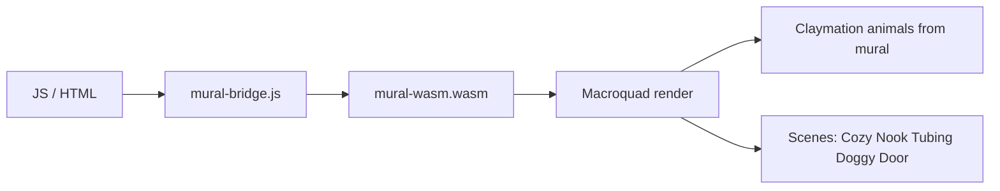

<p align="center">
  
</p>

# OakilyDokily Interactive Mural (Rust + Macroquad, WASM)

High-performance 2D interactive mural targeting `wasm32-unknown-unknown` for web.

## Proof of Artifacts

*Wire diagrams for quick review.*

### Wire / Architecture



### Demo

*Add `docs/artifacts/demo-mural.gif` for pets wandering, interaction, guinea pig kiss.*

---

## Build

```bash
cargo build --target wasm32-unknown-unknown -p mural-wasm --release
```

Output: `target/wasm32-unknown-unknown/release/mural-wasm.wasm`

## Standalone demo

From `oakilydokily/`:

```bash
./mural-wasm/build-standalone.sh   # build + copy WASM and assets
cd mural-wasm && ./serve.sh       # serve at http://127.0.0.1:8765
```

Open http://127.0.0.1:8765/index.html. Assets at `/assets/*` resolve from `mural-wasm/assets/`.

## Features

- **Claymation animals**: 8-bit animals extracted from mural (mural-claymation pipeline)
- **Sprite sheet**: cols=rotations (4), rows=animals; rotation from velocity (left/right)
- **Pet entities**: Wandering, Exodus (scroll-triggered)
- **Scroll-triggered scenes**: Cozy Nook, Winter Tubing, Doggy Door (footer)
- **JS bridge**: `mural_set_scroll_y(y)`, `mural_set_mouse(x, y)`
- **Occlusion culling**: Only pets in viewport are updated
- **FilterMode::Nearest**: Crisp 8-bit pixels

## Assets

`build-standalone.sh` runs the claymation pipeline and copies `claymation_spritesheet.png` + `claymation_meta.json` to `assets/`. Requires `oakilydokily/assets/mural.png`. Falls back to placeholder if missing.

## Claymation pipeline (original mural animals)

Extract animals from the mural, inpaint background, pixelate, rotate, composite. **Pure Rust:**

```bash
# From workspace root (parent of oakilydokily) or oakilydokily:
cargo run -p mural-claymation -- -o out_rust
```

Or Python: `cd mural-wasm/scripts && pip install -r requirements.txt && python claymation_pipeline.py -o out_claymation`

Outputs: `background_filled.png`, `animal_XX_rotYY.png`, `frame_sample.png`, `claymation_spritesheet.png`.

## Integration

Embed in oakilydokily hero:

```html
<canvas id="glcanvas"></canvas>
<script src="/assets/gl.js"></script>
<script src="/assets/mural-bridge.js"></script>
<script>load("/assets/mural-wasm.wasm");</script>
```
