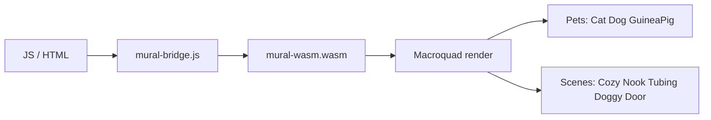

# OakilyDokily Interactive Mural (Rust + Macroquad, WASM)

High-performance 2D interactive mural targeting `wasm32-unknown-unknown` for web.

## Proof of Artifacts

*Wire diagrams for quick review.*

### Wire / Architecture



### Demo

*Add `docs/artifacts/demo-mural.gif` for pets wandering, interaction, guinea pig kiss.*

---

## Build

```bash
cargo build --target wasm32-unknown-unknown -p mural-wasm --release
```

Output: `target/wasm32-unknown-unknown/debug/mural-wasm.wasm` (or `release/` with `--release`)

Copy to `mural-wasm/` and serve with `index.html`.

## Features

- **SpriteSheet**: Algorithmic grid slicing (4×3 default)
- **TextureAtlas**: Cats (row 0), Dogs (row 1), Guinea Pigs (row 2); Walk, Interaction, Sleeping, Kiss
- **Pet entities**: Wandering, Sleeping, Interacting states
- **Proximity detection**: Same species within 30px → Interaction
- **Guinea Pig kiss**: Heart particles via Macroquad
- **Scroll-triggered scenes**: Cozy Nook, Winter Tubing, Doggy Door (footer)
- **JS bridge**: `mural_set_scroll_y(y)`, `mural_set_mouse(x, y)` — call from JS to pass scroll/mouse
- **Occlusion culling**: Only pets in viewport are updated
- **FilterMode::Nearest**: Crisp 8-bit pixels (no linear filtering)

## Asset

Place sprite sheet at `assets/1000003453.png`. Grid: 4 cols × 3 rows. Falls back to white placeholder if missing.

## Integration

Embed in oakilydokily hero:

```html
<canvas id="glcanvas"></canvas>
<script src="/assets/gl.js"></script>
<script src="/assets/mural-bridge.js"></script>
<script>load("/assets/mural-wasm.wasm");</script>
```
